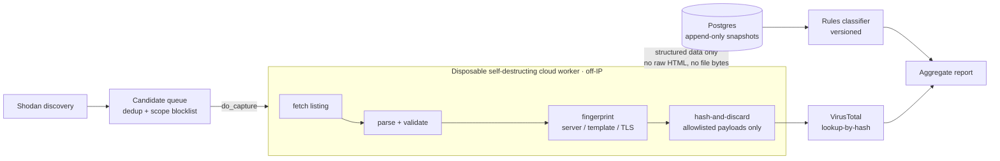

# patefact

*Latin* patefacio *— "to lay open, expose, bring to light."*

> Measure, classify, and safely triage publicly exposed **open directories** at internet scale — without your IP, or a single byte of PII/CSAM, ever touching the risky part.

Open directories (misconfigured autoindex listings — `Index of /`) routinely expose backups, credentials, source code, and sometimes malware. **patefact** is a reproducible research pipeline that finds them, characterizes them, and classifies them onto an *intentional → sensitive → malicious* spectrum — with safety engineered into the architecture rather than bolted on.

The design goal: **do the dangerous work off-box and prove you never captured anything you shouldn't have.**

## What it does — and what it won't

| ✅ Does | ⛔ Won't |
|---|---|
| Reads the directory **listing** a server already serves to anyone — filenames, sizes, dates | Open, read, parse, or run the **contents** of any exposed file |
| **Best-guesses** each host's risk from **filenames + extensions** (a name-based heuristic) | Guess paths, bypass auth, or exploit anything — it stays fully **passive** |
| Downloads *only* an allowlist of **executables/scripts**, and only to hash-and-discard | Download data files (`.env`, `.sql`…), documents, media, or archives — those are **named only, never fetched** |
| Fingerprints those few payloads (SHA-256 / TLSH) and checks them on **VirusTotal by hash** | **Submit or upload** any file or sample anywhere — VirusTotal is queried, never fed |
| Fetches + parses everything on a **disposable, self-destructing worker**, off your IP | Touch untrusted HTML — or your IP — on your own machine |
| Reports **aggregate** figures with host pseudonyms (`host-7f3a2c`) | Publish addresses, operators, or anything that identifies a victim |

> **On the handful of files it hashes:** even those aren't *opened* in any meaningful sense — the bytes are pulled into the sandbox purely to compute a fingerprint, then discarded. Nothing is inspected, retained, or executed; only the hash survives, and only the hash is ever looked up. Everything else in a listing is judged from its **name alone**.

## How it works

1. **Discover** candidate open directories via Shodan (`ShodanSource`; Censys host-lookup enrichment is wired in too).
2. **Capture** each listing **entirely inside a disposable, self-destructing cloud worker** — a [DigitalOcean](https://www.digitalocean.com) droplet that deletes itself on a timer (a [Modal](https://modal.com) container is an optional fallback). Fetch, parse, and fingerprint all happen off-box, so requests never originate from your IP and untrusted HTML is never parsed on your machine. Only structured, derived data comes back.
3. **Validate** that a page is genuinely a directory listing (its `<title>`/`<h1>` is `Index of …`), rejecting stale Shodan matches that now serve ordinary websites.
4. **Classify** with a deterministic, **versioned rules engine** into `intentional_public / sensitive_exposure / malicious_staging / benign_index`, storing the full feature vector for reproducibility.
5. **Hash selected payloads** — download *only* an allowlist of executable/script files inside the disposable worker, hash them (SHA-256 / MD5 / TLSH), **discard the bytes**, and look the hashes up on **VirusTotal (never submitted)**. Sensitive-data files (`.env`, `.sql`, …) are documented from the listing and **never downloaded**.

## Findings from a sample run

| | |
|---|---:|
| Candidates discovered (Shodan) | 494 |
| Captured (all off-IP, disposable worker) | 418 |
| Validated open directories | 311 |
| **False positives rejected** (stale `Index of` matches) | **24%** |
| Classified `sensitive_exposure` / `malicious_staging` | 149 / 2 (49%) |
| Exposed `.env` / `.git` / SQL dumps | 59 / 30 / 91 dirs |
| Payloads hash-and-discarded off-box | 16 |
| Flagged malicious by VirusTotal | **0** (the corpus is *exposures*, not malware) |

Roughly half the validated open directories leak something sensitive (`.env`, `.git`, SQL dumps, keys); the other half are benign software/media mirrors — and near-zero are active malware, which is the point: this measures *misconfiguration*, not attacks.

Full aggregate report (no victim addresses): **[`docs/DEMO_REPORT.md`](docs/DEMO_REPORT.md)**, or a visual **[`docs/dashboard.html`](docs/dashboard.html)** — regenerate with `uv run python scripts/generate_report.py` / `scripts/generate_dashboard.py`.

## Pipeline



## Safety & ethics

This is a **defensive / measurement** tool. Harm-avoidance is structural:

- **Off-IP by construction.** All fetching *and* parsing run on a disposable, self-destructing cloud worker (a DigitalOcean droplet via `do_capture`; a Modal container via `--egress modal` is an optional fallback). Requests never originate from your address (verified: the egress IP is the worker's, not your host's), and untrusted HTML is never parsed locally.
- **No PII / CSAM capture.** Only an allowlist of executable/script files is *ever* downloaded — media (CSAM), archives (opaque), documents and data files like `.env`/`.sql` (PII) are **never fetched**, only documented from the listing.
- **Hash-and-discard.** Downloaded bytes exist only briefly in the sandbox; only hashes are stored — never contents.
- **Passive & lookup-only.** No path guessing, no auth attempts, no exploitation. VirusTotal is queried *by hash* — samples are never submitted (which would make them public).
- **SSRF-safe.** Redirects are validated hop-by-hop; private/reserved IPs, cloud-metadata endpoints, `localhost`/`.internal`, and `.gov`/`.mil` are blocklisted by default.
- **Aggregate reporting.** Reports withhold individual host addresses — these are live exposures.

Reading a publicly served listing is passive; downloading crosses a higher bar, which is why it is gated, sandboxed, allowlisted, and hash-and-discard. **You are responsible for ensuring your use is authorized in your jurisdiction.**

## Quickstart

Requires Python ≥3.12, Docker, [`uv`](https://docs.astral.sh/uv/), and — for off-IP capture — a [DigitalOcean](https://www.digitalocean.com) account (disposable-droplet worker) or a [Modal](https://modal.com) account (optional fallback). A Shodan Membership (`SHODAN_API_KEY`) unlocks filtered discovery; `VT_API_KEY` is optional.

```bash
docker compose up -d db          # Postgres 16
uv sync
cp .env.example .env             # fill in SHODAN_API_KEY, OPENDIR_CONTACT, (optional) VT_API_KEY
uv run python manage.py migrate

# discover candidates (Shodan)
uv run python manage.py discover --source shodan --query 'http.title:"Index of /"'

# capture OFF-IP on a disposable, self-destructing DigitalOcean droplet
# (needs DO_TOKEN, DO_DELETE_TOKEN, DO_SSH_KEY_FINGERPRINT in .env — see .env.example)
uv run python manage.py do_capture --limit 50
#   ...or run capture through a Modal container instead (optional fallback):
#   uv run modal setup && uv run modal deploy opendir/capture/modal_app.py
#   uv run python manage.py capture --egress modal --limit 50

# validate + classify what came back
uv run python manage.py classify

# optional: hash allowlisted payloads off-box + VirusTotal lookup-by-hash
uv run python manage.py hash_payloads
uv run python manage.py vt_lookup            # needs VT_API_KEY

# aggregate report
uv run python scripts/generate_report.py > docs/DEMO_REPORT.md
```

Browse everything in Django admin (`uv run python manage.py runserver` → `/admin/`).

## Status

**Built:** capture foundation, SSRF-safe collection hardening, Shodan discovery, off-IP egress via **disposable self-destructing DigitalOcean droplets** (`do_capture`; a Modal container remains an optional fallback), autoindex validation, rules-first **versioned** classification with a **behavioral gold-set eval harness** (`scripts/eval_classifier.py`, confusion matrix + accuracy), type-restricted payload hashing + VirusTotal enrichment, an anonymized per-host file inventory + network-profile chart + potential-honeypot detector, and a self-contained **HTML dashboard** (`scripts/generate_dashboard.py`). **285 tests.** Licensed **Apache-2.0**.

**Planned:** an infrastructure/relationship **graph** — cluster hosts by shared certs, favicon/template fingerprints, and payload **TLSH** fuzzy-hashes (already collected) to surface campaigns like the one-host-many-ports SQL-dump fan-out seen in the sample run.

## Reproducibility

Deterministic throughout: append-only snapshots, versioned feature extractor + ruleset, and a feature vector stored with every classification — any verdict can be reproduced or re-run under a new ruleset.

## License

Licensed under the **[Apache License 2.0](LICENSE)**. The [`NOTICE`](NOTICE) file carries copyright and a **responsible-use / authorization notice** that redistributors must retain.

The license disclaims warranties and limits the authors' liability for the *software*. It does **not** authorize how you *operate* it: network measurement is conduct governed by computer-misuse and data-protection law (e.g. CFAA, UK Computer Misuse Act, GDPR) independent of this license. **Ensuring your use is lawful and authorized is your responsibility** — see [`NOTICE`](NOTICE) for the full terms.

---

*Research tooling. Use responsibly and only where authorized.*
